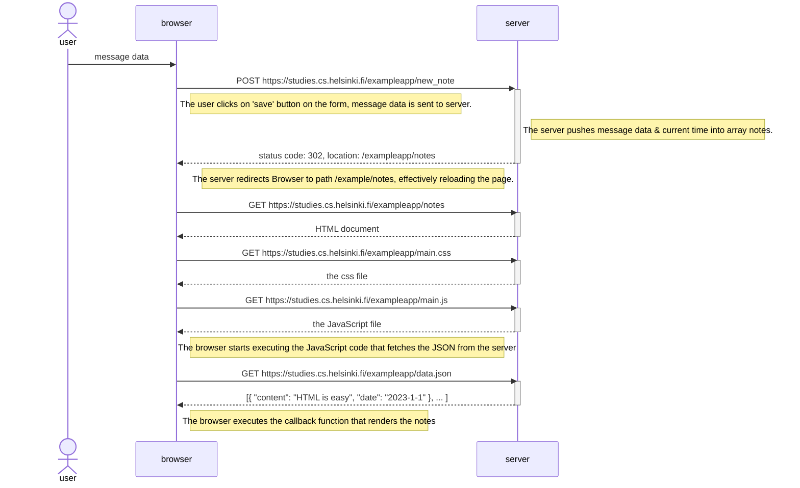

# Creating new notes

```mermaid
sequenceDiagram
    %% idk if user is needed im new to this.
    actor user
    participant browser
    participant server
    
    user->>browser: message data

    browser->>+server: POST https://studies.cs.helsinki.fi/exampleapp/new_note
    Note right of browser: The user clicks on 'save' button on the form, message data is sent to server.
    Note right of server: The server pushes message data & current time into array notes.
    server-->>-browser: status code: 302, location: /exampleapp/notes
    Note left of server: The server redirects Browser to path /example/notes, effectively reloading the page.

    %% just copied it from the website since it does the same thing.
    browser->>server: GET https://studies.cs.helsinki.fi/exampleapp/notes
    activate server
    server-->>browser: HTML document
    deactivate server

    browser->>server: GET https://studies.cs.helsinki.fi/exampleapp/main.css
    activate server
    server-->>browser: the css file
    deactivate server

    browser->>server: GET https://studies.cs.helsinki.fi/exampleapp/main.js
    activate server
    server-->>browser: the JavaScript file
    deactivate server

    Note right of browser: The browser starts executing the JavaScript code that fetches the JSON from the server

    browser->>server: GET https://studies.cs.helsinki.fi/exampleapp/data.json
    activate server
    server-->>browser: [{ "content": "HTML is easy", "date": "2023-1-1" }, ... ]
    deactivate server

    Note right of browser: The browser executes the callback function that renders the notes
```