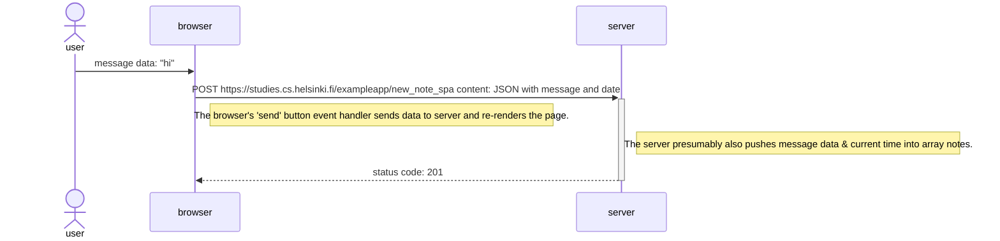

#  Creating new notes in the *single-page app* version

```mermaid
sequenceDiagram
    actor user
    participant browser
    participant server
    
    user->>browser: message data: "hi"

    browser->>+server: POST https://studies.cs.helsinki.fi/exampleapp/new_note_spa content: JSON with message and date
    Note right of browser: The browser's 'send' button event handler sends data to server and re-renders the page.
    Note right of server: The server presumably also pushes message data & current time into array notes.
    server-->>-browser: status code: 201
```